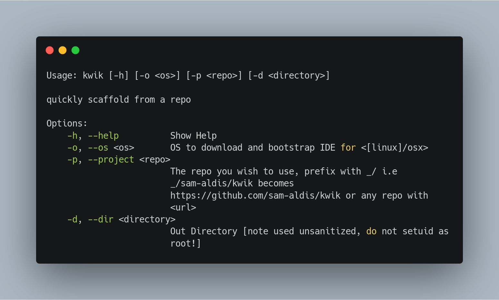

# KWIK

Quickly Scaffold and setup a new project with a code-server.

Clone *any* github project and download and bootstrap a code-server
running ready for you to start coding.




```sh
# use kwik -h for access to the usage:
~/Projects $ kwik -h
Usage: kwik [-h] [-o <os>] [-p <repo>] [-d <directory>]

quickly scaffold from a repo

Options:
    -h, --help          Show Help
    -o, --os <os>       OS to download and bootstrap IDE for <[linux]/osx>
    -p, --project <repo>
                        The repo you wish to use, prefix with _i.e
                        _sam-aldis/kwik becomes
                        https://github.com/sam-aldis/kwik or any repo with
                        <url>
    -d, --dir <directory>
                        Out Directory [note used unsanitized, do not setuid as
                        root!]

```

building yourself:
```sh
$ git clone https://github.com/sam-aldis/kwik.git
$ cd kwik
$ cargo build --release
$ sudo cp ./target/release/kwik /usr/local/bin/
```

quickstart for new projects (with docker)
```sh
$ docker run -it -p 9091:9091 ukjp/kwik
> kwik -o linux -p _/sam-aldis/kiwk -d kwik-dev
```
