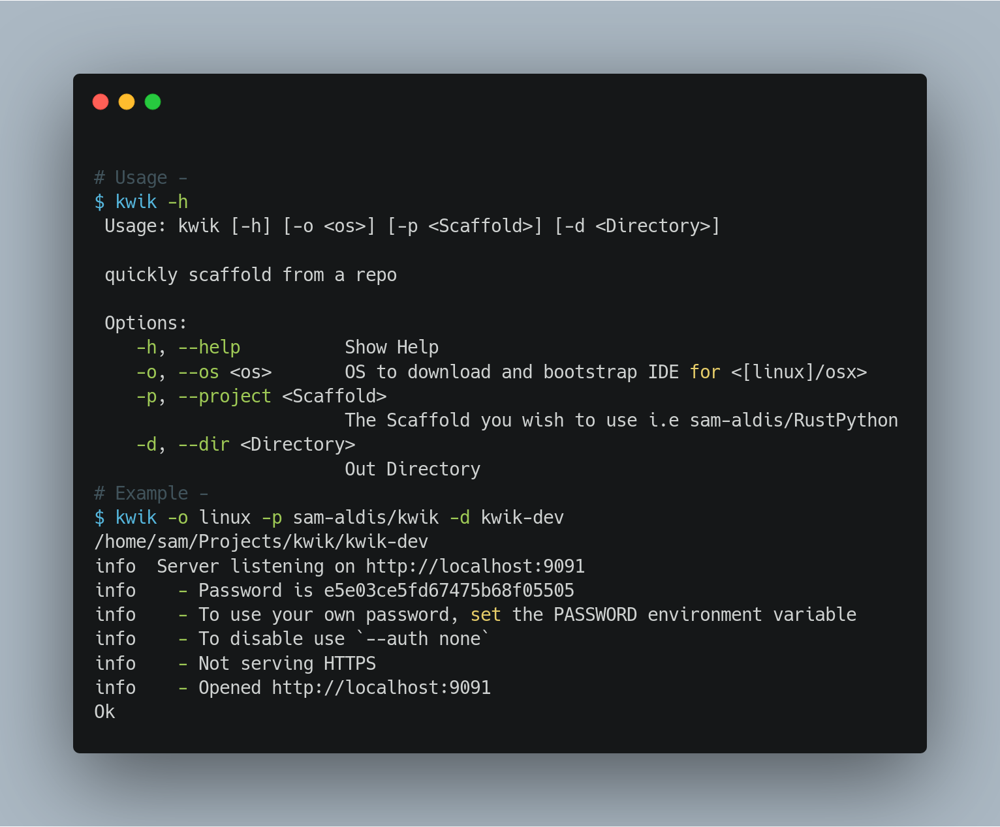

# KWIK

Quickly Scaffold and setup a new project with a code-server.

Clone any github project and download and bootstrap a code-server
running ready for you to start coding.




```sh
# use kwik -h for access to the usage:
~/Projects $ kwik -h
Usage: kwik [-h] [-o <os>] [-p <Scaffold>] [-d <Directory>]

quickly scaffold from a repo

Options:
    -h, --help          Show Help
    -o, --os <os>       OS to download and bootstrap IDE for <[linux]/osx>
    -p, --project <Scaffold>
                        The Scaffold you wish to use i.e sam-aldis/RustPython
    -d, --dir <Directory>
                        Out Directory

```
